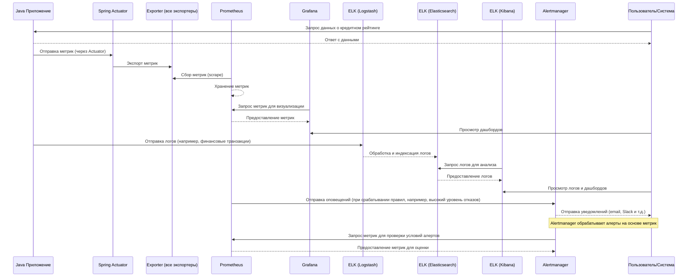

# Проект: Обеспечение мониторинга для платформы кредитного скоринга

## Описание
Платформа для кредитного скоринга предназначена для оценки кредитоспособности пользователей на основе их финансовых данных, истории транзакций и других параметров. Цель — предоставить пользователям интерфейс для подачи заявок на кредит и отслеживания их кредитного рейтинга, а кредиторы могут анализировать заявки и принимать решения на основе собранных данных.


## Описание диаграммы
   - **Java Приложение** (JA) взаимодействует с **Spring Actuator** (ACT) для отправки метрик, которые затем экспортируются всеми экспортерами (EXP).
   - **Prometheus** (PROM) собирает метрики через функцию scrape и хранит их.
   - **Grafana** (GRAF) запрашивает метрики из Prometheus для визуализации, и пользователь (USER) может просматривать дашборды.
   - **Java Приложение** также отправляет логи в **Logstash** (LS), который обрабатывает эти логи и передает их в **Elasticsearch** (ES) для индексации.
   - **Kibana** (KIB) запрашивает данные из Elasticsearch для анализа, и пользователь может просматривать логи.
   - **Prometheus** также отправляет оповещения в **Alertmanager** (AM) по установленным правилам, и Alertmanager отправляет уведомления пользователю через email или Slack.

## Основные функции:
- Оценка кредитоспособности заемщиков на основе их доходов, долгов и финансовой истории.
- Предоставление пользователям интерфейса для отслеживания кредитного рейтинга и подачи заявок на кредит.
- Инструменты анализа и принятия решений для кредиторов на основе собранных данных.

## Основные компоненты:

1. **Сбор данных**:
   - **Финансовые данные**: Информация о доходах, расходах, задолженностях и предыдущих кредитах пользователей.
   - **История транзакций**: Логи покупок, переводов и других финансовых операций.
   - **Дополнительные данные**: Семейное положение, занятость и другие факторы, влияющие на кредитное решение.

2. **Оценка кредитного рейтинга**:
   - Разработка модели, использующей собранные данные для вычисления кредитного рейтинга.
   - Внедрение алгоритмов для повышения точности оценки (например, регрессия, деревья решений).

3. **Интерфейс для пользователей и кредиторов**:
   - Веб-интерфейс, где пользователи могут подавать заявки на кредит и отслеживать свой рейтинг.
   - Панель для кредиторов с возможностью просмотра заявок, анализа рисков и утверждения кредитов.

## Стек технологий:

1. **Сбор и визуализация метрик**:
   - **Метрики**: Использование Spring Boot и Actuator для сбора метрик производительности приложения.
   - **Prometheus**: Хранение и запросы метрик.
   - **Grafana**: Визуализация собранных метрик, таких как количество пользователей по кредитным рейтингам и среднее время обработки заявок.

2. **Сбор и анализ логов**:
   - **Logstash**: Сбор логов системы и транзакций пользователей.
   - **Elasticsearch**: Хранение и поиск логов для отслеживания действий и поиска ошибок.
   - **Kibana**: Визуализация логов для анализа событий и быстрого реагирования на инциденты.

3. **Оповещения**:
   - **Prometheus**: Настройка алертов на основе метрик (например, если количество кредитных заявок превышает норму).
   - **Alertmanager**: Отправка уведомлений через Slack или Email для реагирования на критические ситуации (например, сбои в системе).

> **Как это работает**: Используя Prometheus и Node Exporter, можно собирать метрики о производительности сервисов, которые парсят рыночные данные.

## Алерты и мониторинг:
- Уведомления о резких изменениях в количестве новых заявок на кредит.
- Оповещения о высоком уровне отказов по кредитам, что может сигнализировать о проблемах в системе.
- Мониторинг производительности сервера и базы данных для обеспечения надежной работы платформы.

## Требования к безопасности:
- Шифрование данных пользователей и обеспечение конфиденциальности.
- Аутентификация и авторизация с использованием OAuth 2.0 или JWT.
- Защита от атак, таких как SQL-инъекции и DDoS-атаки.

## Структура проекта

```
├───alertmanager 
├───docker
├───elk
├───exporter
├───grafana
│   └───dashboards
├───java-application
│   ├───.mvn
│   │   └───wrapper
│   ├───src
│   │   ├───main
│   │   │   ├───java
│   │   │   │   └───credit_score_platform
│   │   │   │       └───demo
│   │   │   └───resources
│   │   └───test
│   │       └───java
│   │           └───credit_score_platform
│   │               └───demo
│   └───target
│       ├───classes
│       │   └───credit_score_platform
│       │       └───demo
│       ├───generated-sources
│       │   └───annotations
│       ├───generated-test-sources
│       │   └───test-annotations
│       ├───maven-archiver
│       ├───maven-status
│       │   └───maven-compiler-plugin
│       │       ├───compile
│       │       │   └───default-compile
│       │       └───testCompile
│       │           └───default-testCompile
│       └───test-classes
│           └───credit_score_platform
│               └───demo
└───prometheus
```
